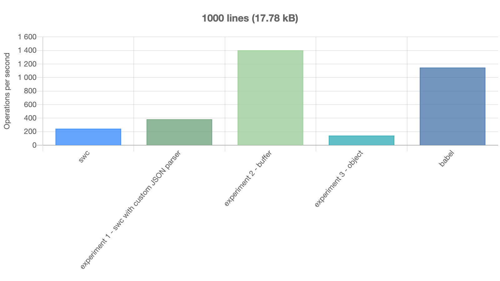
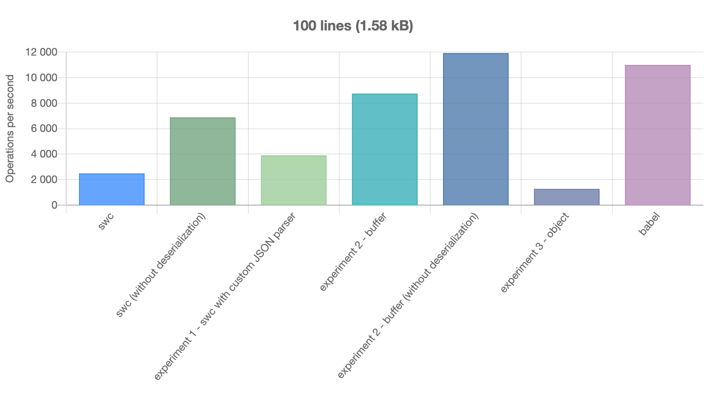
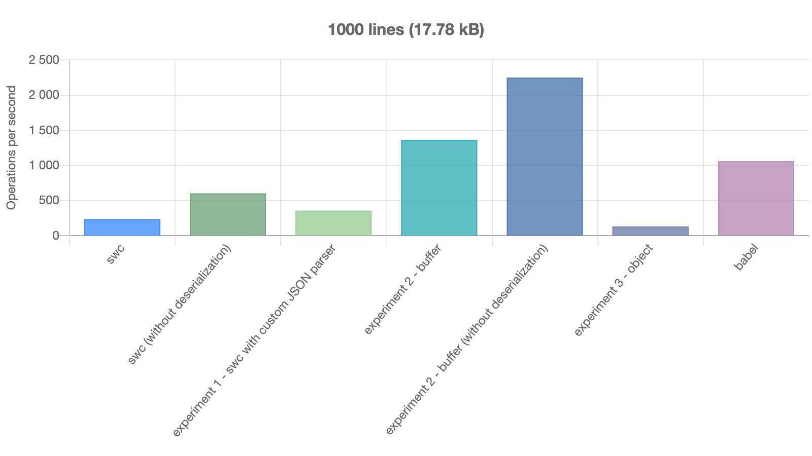
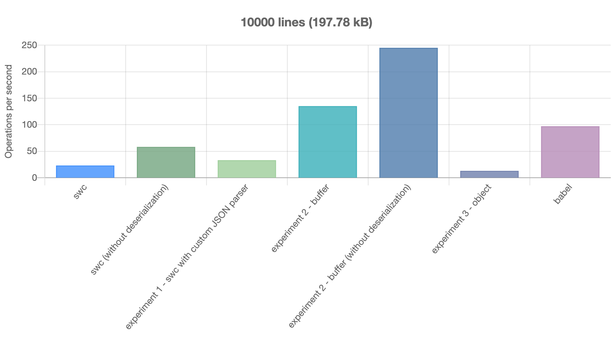

# SWC parse experiments

These are some experiments attempting to speed up SWC's `.parse()` method.

TLDR: One of these experiments is quite successful:



SWC's parser is extremely fast. However, `swc.parse()` / `swc.parseSync()` is slow.

## The problem

There seem to be 2 bottlenecks:

1. Cost of passing AST from Rust to JS (as JSON string)
2. Cost of parsing JSON in JS (using `JSON.parse()`)

## Attempted solutions

I have tried 3 different experiments.

These are all proof of concept only. Implementations shown here can only handle a very limited subset of JavaScript (a sequence of `const x = 1;` statements).

NB Apologies for the poor quality of the Rust code! Before this weekend, I'd never written a line of Rust in my life.

### Experiment 1: Custom JSON parser

The shape of the JSON is predictable, therefore a lot of the work `JSON.parse()` does is redundant.

I wrote a [custom JSON parser](./blob/master/lib/parseJson.js) and substituted it for `JSON.parse()`.

This produces approx 30% speed-up.

### Experiment 2: Binary serialization

Instead of outputting a JSON string from Rust, output a binary serialization of the AST as a `JsBuffer`.

This has 2 advantages:

1. `JsBuffer` can be created in main thread's memory so passing it from Rust to JS is zero cost.
2. AST can be encoded more efficiently in binary form.

This produces approx **5x speed-up**, especially with longer inputs. It achieves a speed faster than Babel.

Both the Rust and JS code is not at all optimized - with futher work, I imagine speed could be further improved.

See [Rust serializer](./blob/master/src/lib.rs) and [JS buffer deserializer](./blob/master/lib/buffer/bufferToAst.js).

### Experiment 3: Create AST as `JsObject` in Rust

Create AST as `JsObject` in Rust, avoiding serialization/deserialization entirely.

Abject failure. Much slower than original SWC.

## Benchmarks

Benchmarks with different lengths of input JS.

```sh
npm install
npm run build
npm test
npm run bench
```

NB: `swc (without deserialization)` and `experiment 2 - buffer (without deserialization)` are not complete. The first returns only a JSON string, the 2nd only a buffer representation of AST. I've included these only as it's interesting to see where the time is going.

Note how slow SWC is on larger files even without deserializing the JSON - indicating the high cost of passing a large JSON string from Rust to JS.




